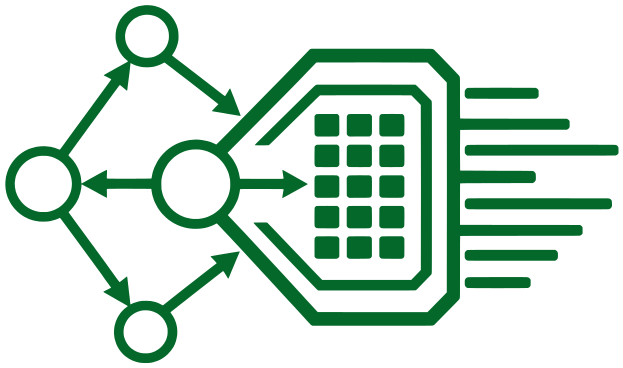
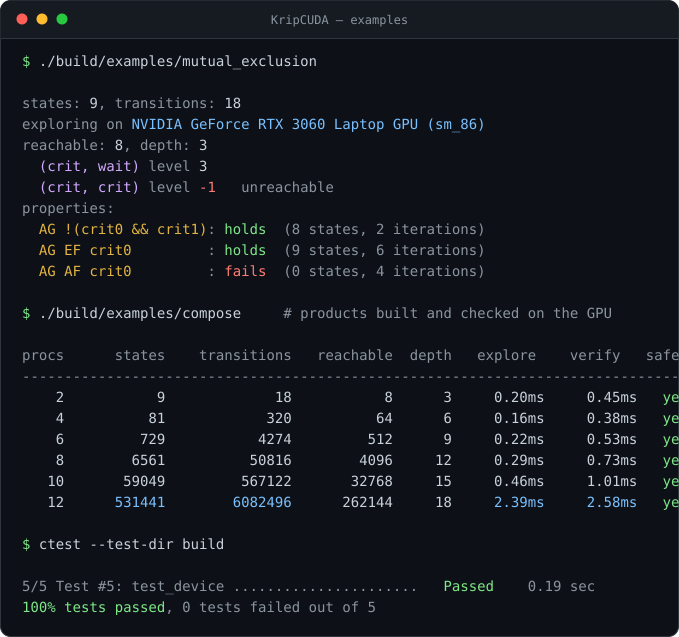

<p align="center">
  
</p>

<h1 align="center">KripCUDA</h1>

<p align="center">

[](https://en.cppreference.com/w/cpp/20)
[](https://developer.nvidia.com/cuda-toolkit)
[](https://cmake.org)
[](https://developer.nvidia.com/cuda-gpus)
[](tests)

</p>

<p align="center">
GPU-accelerated explicit-state model checking of Kripke structures in C++20 and CUDA.
</p>

<p align="center">
  
</p>

## Formal setting

A **Kripke structure** over a finite set of atomic propositions *AP* is a tuple

> *M* = (*S*, *S₀*, *R*, *L*)

with *S* a finite set of states, *S₀* ⊆ *S* the initial states, *R* ⊆ *S* × *S* a
*total* transition relation — every state has at least one successor — and
*L*: *S* → 2^*AP* a labelling assigning to each state the propositions true in
it. Totality is what makes every finite prefix extendable to an infinite path,
so the branching-time semantics below are well defined on paths
π = *s*₀*s*₁*s*₂… with (*s*ᵢ, *s*ᵢ₊₁) ∈ *R*.

KripCUDA stores *R* in compressed sparse row form: *R* is the sparse boolean
adjacency matrix of the state graph, and the successor list of a state is one of
its rows. The labelling is a packed bitset — *L*(*s*) as ⌈|*AP*|/64⌉ machine
words — so evaluating a propositional formula at a state is a handful of bitwise
operations, and evaluating it at *all* states is a data-parallel scan over a
dense array.

The library enforces the structural invariants of the definition at construction
time rather than trusting the caller: totality of *R* is checked, duplicate
transitions are removed, and successor lists are sorted, which makes the CSR
layout (and therefore every kernel launch configuration derived from it) a
function of the model alone and not of the order in which the caller happened to
supply its transitions.

## Verification as fixpoint computation

Model checking asks whether *M*, *s* ⊨ φ. For branching-time logics the
computation is a fixpoint over the powerset lattice (2^*S*, ⊆), which is complete
and finite; the modal operators are monotone on it, so by Knaster–Tarski their
least and greatest fixpoints exist and — the lattice having finite height |*S*| —
are reached by Kleene iteration in at most |*S*| steps. Writing
*pre*∃(*X*) = { *s* | ∃*s*′ ∈ *X*. (*s*, *s*′) ∈ *R* } for the existential
pre-image, CTL is characterised by

- ⟦EX φ⟧ = *pre*∃(⟦φ⟧)
- ⟦E φ U ψ⟧ = μ*X*. ⟦ψ⟧ ∪ (⟦φ⟧ ∩ *pre*∃(*X*))
- ⟦EG φ⟧ = ν*X*. ⟦φ⟧ ∩ *pre*∃(*X*)

with the remaining operators derived by duality. Every one of these is a
sequence of *pre*∃ applications interleaved with set operations, and *pre*∃ is
exactly a sparse matrix–vector product over the boolean semiring (∨, ∧) against
*Rᵀ*. The characteristic function of a state set is a bit array over *S*; set
union and intersection are elementwise disjunction and conjunction on it. This
is the reason the whole verification problem is a good fit for a GPU: the inner
operation is an irregular but massively data-parallel SpMV, and the outer loop is
a short sequence of dependent kernel launches whose termination test is a single
scalar reduction.

Reachability, the first of these computations to be implemented here, is the
dual direction: the least fixpoint μ*X*. *S*₀ ∪ *post*∃(*X*) of the image
operator, which is the set of states of *M* that any run can actually occupy.
It is computed frontier-by-frontier — a level-synchronous breadth-first
expansion, one kernel launch per BFS level — which additionally yields the
distance of each state from *S*₀ and hence the diameter of the reachable
fragment. Restricting later verification to that fragment is sound for the
properties that quantify over runs of the system, and is usually a substantial
reduction: in the example above only 8 of the 9 syntactically representable
states are reachable, and it is precisely the unreachable one, (crit, crit),
that would violate mutual exclusion.

The fixpoint characterisation also explains why the parallelisation is safe.
Kleene iteration of a monotone operator converges to the same limit regardless
of the order in which elements are added within an iteration, so the
nondeterministic order in which GPU threads claim states cannot change the
result. In the reachability kernel each state is claimed by a single atomic
compare-and-swap that simultaneously assigns its BFS level; every thread that
could claim a state within a given level writes the same value, so the computed
level array is deterministic and bit-identical to the sequential reference, even
though the frontier order is not.

## The explicit-state trade-off

Explicit-state checking enumerates *S* rather than encoding it symbolically as a
BDD. It surrenders the compression that symbolic methods obtain on structured,
regular models, and pays the full price of the state explosion problem — |*S*|
grows exponentially in the number of concurrent components. What it buys is a
representation whose cost is predictable, whose successor computation is a
memory-bound graph traversal rather than a pointer-chasing operation on a shared
decision-diagram node table, and whose parallelism is not bottlenecked by a
global unique table. On hardware with thousands of concurrently resident threads
and an order of magnitude more memory bandwidth than a host, that trade is
frequently the favourable one, and it becomes more so as the model grows less
regular — exactly the regime in which BDD-based approaches degrade.

The design consequence is that the state graph is materialised once, uploaded
once, and then repeatedly traversed by kernels that never transfer it back:
host–device traffic per verification run is one small scalar per iteration for
the termination test, plus one result vector at the end.

## The device layer

Everything above is realised by a device layer that is the bulk of the library.

**Set algebra.** A state set is a packed bitset whose word is 32 bits wide, so
that one warp covers exactly one word. Every set-producing kernel evaluates its
predicate one state per lane and assembles the word with a single
`__ballot_sync` no atomics, no shared memory, no scatter. Lanes whose state
lies past |*S*| contribute a false predicate, which is precisely what keeps the
padding bits of the last word at zero; the reductions that count, compare and
test inclusion depend on that invariant, and complement is the one operation
that must restore it explicitly. Union, intersection, difference and assignment
are one templated elementwise kernel, and the reductions collapse within a warp
before a single lane touches global memory.

**Pre-image.** ⟦EX φ⟧ and the body of both fixpoints are the same gather: each
state inspects its own successor list and reports whether any successor lies in
the operand. Computing the pre-image forwards rather than transposing the
relation is what lets the framework store *R* once there is no *Rᵀ* anywhere,
no scatter, and no atomic traffic in the hot loop. The fixpoint step is fused
into a single kernel, `next = base ∪ (mask ∩ pre∃(current))`, with a null
operand denoting the neutral element, so EU and EG are that same kernel launched
from different initial sets and converging from opposite directions.

**Traversal.** Breadth-first exploration keeps an explicit frontier queue and
appends to it with one atomic per warp rather than one per claim: each lane
buffers its claims in registers, the warp prefix-sums the per-lane counts, and a
single lane reserves the range. Whether a state is expanded by one thread or by
a whole warp is decided from the model's degree distribution, which the device
computes by reduction when the model is uploaded thread-per-state while
successor lists are short, warp-per-state once they exceed a warp, where a lone
lane would otherwise serialise a long list while its siblings idle.

**Composition.** Products of two device-resident models are built entirely on
the GPU: one kernel counts the degree of every product state, a device-wide
exclusive scan in reduce-then-scan form turns those counts into row offsets, and
a second kernel fills the columns. Because the index map (*s*₁, *s*₂) ↦
*s*₁·|*S*₂| + *s*₂ is monotone in each component, a linear merge of the two
sorted successor lists emits the interleaving product already sorted, and the
one transition a product state can acquire twice both components self-looping
is subtracted when the degrees are counted. Labels are concatenated by a
bit-level shift of a multi-word bitset. The result is a model that has never
been on the host and that the explorer and the evaluator consume in place: the
run above composes six components and verifies half a million states without the
transition relation ever crossing the bus.

**Cycles and fairness.** Liveness under a fairness assumption is not a fixpoint
over the labelling but a question about cycles: a fair execution exists exactly
when some strongly connected component lies on a cycle and meets every
constraint. The decomposition runs on the device by parallel colouring — every
live state takes the largest state index that can reach it, and a state that
keeps its own colour is a root whose colour class, closed backwards, is one
complete component. Colours propagate as a gather over the transpose, so no pass
writes an entry it does not own; the backward closure is a gather over the
forward relation, the same pre-image the model checker already computes. Each
round is preceded by trimming, which removes the states with no live successor
or no live predecessor — in a concurrent model that is most of them, and each one
removed is a component the colouring never has to look at. The transpose that
trimming needs is the one place the library builds *Rᵀ*, and it too is built on
the GPU: in-degrees counted with one atomic per edge, scanned into row offsets,
filled by a second pass. ⟦EG_fair φ⟧ then falls out as the fair components of the
subgraph induced by φ, closed backwards inside it.

## Architecture

The library keeps model representation, state exploration, property
verification, CUDA execution, and utilities in separate compilation units and
namespaces, with the coupling running in one direction only. Kernels receive
trivially copyable views of device-resident data; ownership sits in RAII handles
on the host buffers, streams, events, scan workspaces and every CUDA API
result is checked and surfaced as a C++ exception. The extension says which is
which: a `.hpp` header is plain C++20 and a `.cuh` header carries device code or
CUDA runtime types and is meant for translation units compiled by NVCC. The
CUDA-availability queries are deliberately exposed through a `.hpp` that
includes no CUDA header at all, so host-only consumers never inherit the
toolkit's include path.

Every device computation has a sequential counterpart implementing the same
schedule step for step, and the suite holds them against each other on
hand-checkable models, on pseudo-random ones, and on randomly generated CTL
formulas. The two evaluators are required to agree not only on the satisfying
set but on the number of fixpoint iterations, so a disagreement can only come
from the parallel implementation and never from a difference in semantics.

## Building

Requires CMake 3.22 or newer, a C++20 host compiler, and CUDA 12 or newer.

```sh
cmake -S . -B build -G Ninja -DKRIPCUDA_CUDA_ARCHITECTURES=86
cmake --build build
ctest --test-dir build --output-on-failure
```

`KRIPCUDA_CUDA_ARCHITECTURES` (default `75;86;89`) selects the generated device
code; set it to the compute capability of the target GPU. The device suites skip
themselves and the host-facing example falls back to the sequential path when no
CUDA device is visible, so the suite is meaningful on machines without one.

## Usage

A model is assembled through `KripkeBuilder`, which validates it and hands back
an immutable `KripkeStructure`:

```cpp
#include "kripcuda/exploration/reachability.hpp"
#include "kripcuda/verification/ctl.hpp"

using namespace kripcuda;

KripkeBuilder builder(stateCount, propositionCount);
builder.addInitialState(0);
builder.addTransition(0, 1);
builder.setLabel(1, criticalSection);
const KripkeStructure model = builder.build();

const ReachabilityResult reachable = computeReachabilityDevice(model);
```

`ReachabilityResult::levels[s]` is the BFS distance of state `s` from the
closest initial state, or `kUnreachable`. The GPU and host explorers produce
identical levels for the reason given above: the fixpoint does not depend on the
order in which states are claimed, even though the frontier order on the GPU is
nondeterministic. `computeReachabilityHost` is the sequential reference and can
be called on the same model when no device is available.

Formulas are values built from an adequate basis, with the universal operators
derived by the standard identities. Repeated subformulas are shared, and the
evaluators memoise on node identity:

```cpp
using namespace kripcuda::ctl;

const Formula safety = AG(!(atom(critical0) && atom(critical1)));
const CtlResult result = checkCtlDevice(model, safety);

result.holdsInAllInitialStates;   // M ⊨ φ
result.satisfying.count();        // |⟦φ⟧|
```

Larger models are composed on the device and checked without ever being brought
back. A `DeviceCtlEvaluator` kept alive across several formulas reuses both the
model and the subformulas already evaluated:

```cpp
#include "kripcuda/cuda/product.cuh"
#include "kripcuda/verification/ctl_device.cuh"

Stream stream;
const DeviceKripke component(model, stream);
const DeviceKripke composed = buildPower(component, 6, ProductKind::Interleaving, stream);

DeviceCtlEvaluator evaluator(composed, stream);
const CtlResult verdict = evaluator.check(safety);
```

`examples/mutual_exclusion.cpp` builds the two-process model and checks the
three properties shown at the top of this page; `examples/compose.cu` produces
the scaling table beside them; `examples/fair_cycle.cu` answers the liveness
question the first of those leaves open, under an explicit fairness assumption.

> ## Build note
> CMake before 3.25 cannot express the CUDA20 dialect for NVCC and derives it from
`CMAKE_CXX_STANDARD`, which fails at generate time. The device sources therefore
live in a separate object library that requests `-std=c++20` from NVCC directly.
