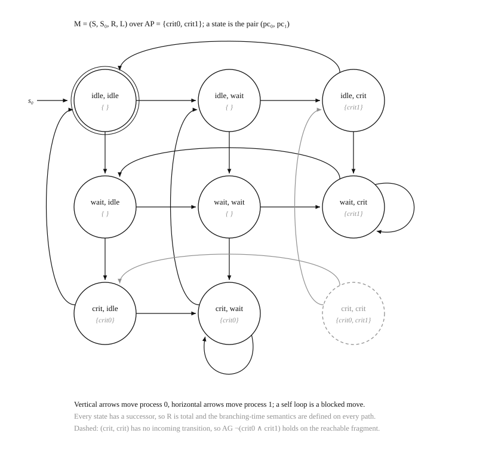

# Examples

Two programs: one small enough to check by hand, one large enough to need the
GPU. Both are built by default; pass `-DKRIPCUDA_BUILD_EXAMPLES=OFF` to skip
them.

## The model

Both examples are built from the same component, a two-process mutual exclusion
protocol. A process is *idle*, *waiting*, or *critical*; it may enter its
critical section only while the other process is not in its own, and it releases
it eventually. Scheduling is nondeterministic: in every state either process may
be the one to move.

A state is the pair of program counters (*pc*₀, *pc*₁), giving |*S*| = 9, and
the two atomic propositions `crit0` and `crit1` mark each process being in its
critical section. Every state has exactly two successors, one per process, so
the transition relation is total, as the semantics of CTL require.

<p align="center">
  
</p>

Two features of the structure are worth naming, because the examples exist to
demonstrate them:

- **The self loops are blocked moves.** From (wait, crit) process 0 may not
  enter, so its move leaves the state unchanged. This is what keeps the relation
  total without inventing behaviour, and it is also why the model has infinite
  runs on which a waiting process never proceeds.
- **(crit, crit) has no incoming transition.** Mutual exclusion is a property of
  the *reachable* fragment: the violating state exists in *S*, and the protocol
  is safe precisely because nothing reaches it.

## `mutual_exclusion`. properties of a nine-state model

Explores the model and evaluates three CTL formulas over it, on the GPU when one
is visible and on the sequential path otherwise.

```
$ ./build/examples/mutual_exclusion
states: 9, transitions: 18
exploring on NVIDIA GeForce RTX 3060 Laptop GPU (sm_86)
reachable: 8, depth: 3
  (idle, idle) level 0
  ...
  (crit, crit) level -1
properties:
  AG !(crit0 && crit1): holds (8 states, 2 iterations)
  AG EF crit0         : holds (9 states, 6 iterations)
  AG AF crit0         : fails (0 states, 4 iterations)
```

The three verdicts are the point of the example:

- `AG !(crit0 && crit1)` — **safety**, and it holds. The satisfying set has eight
  states rather than nine: (crit, crit) itself does not satisfy the formula, and
  it does not need to, because it is unreachable.
- `AG EF crit0` — from every state process 0 *can* still reach its critical
  section. The protocol never deadlocks and never starves a process
  irrecoverably.
- `AG AF crit0` — process 0 *must* eventually reach it. This fails, and the
  failure is not a bug in the protocol but the absence of a fairness constraint:
  nothing in the model forces the scheduler ever to pick a waiting process, so
  the run that lets process 1 move forever is a legitimate counterexample. Weak
  fairness is what would rule it out, and it is a property of the composition,
  not of either process.

## `compose`. composition on the device

Builds interleaving products of the component on the GPU, explores each state
space, and verifies mutual exclusion for every component of the composition.
Requires a CUDA device.

```
$ ./build/examples/compose
procs      states    transitions   reachable  depth   explore    verify   safe
-------------------------------------------------------------------------------
    2           9             18           8      3     0.20ms     0.45ms   yes
    4          81            320          64      6     0.16ms     0.38ms   yes
    6         729           4274         512      9     0.22ms     0.53ms   yes
    8        6561          50816        4096     12     0.29ms     0.73ms   yes
   10       59049         567122       32768     15     0.46ms     1.01ms   yes
   12      531441        6082496      262144     18     2.39ms     2.58ms   yes
```

The table is the state explosion problem in miniature: each pair of processes
multiplies |*S*| by nine and the reachable fragment by eight, while the diameter
grows only by three. Nothing but the nine-state component is ever uploaded —
every larger model is a product of device-resident operands, and both the
explorer and the CTL evaluator consume it in place.

The specification checked at each size is a conjunction of one `AG` per
component. Because formulas are shared DAGs and the evaluator memoises on node
identity, the common subformulas of that conjunction are evaluated once.

## Notes

`mutual-exclusion-model.svg` is generated rather than drawn: the script derives
the transitions from the same step function the example uses, and computes the
reachable set by forward search, so the diagram cannot drift from the code. The
generator itself is not tracked.
